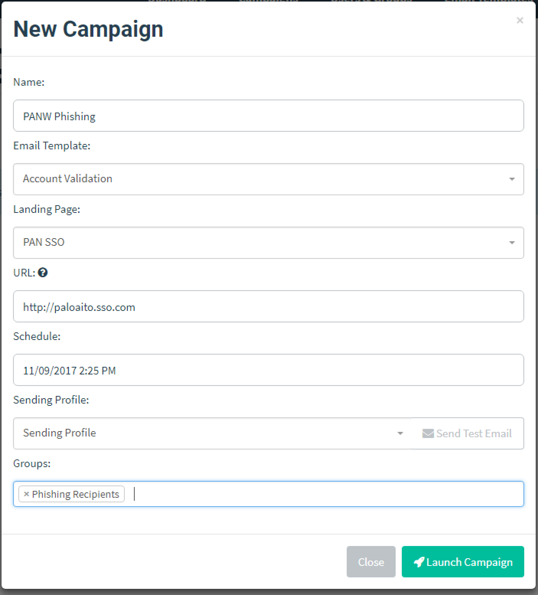

<h1>Credential Phishing Prevention</h1>

There are 3 methods to check for corporate credential submissions that you can use on the firewall
to detect users when they submit credentials to web pages.

The three methods are:

1. Group Mapping
2. IP User Mapping
3. Domain Credential Filter

In this lab, you will configure the firewall to check submitted credentials via the **Domain 
Credential Filter** method.

---

<h1>Configuration Steps</h1>

### Phishing Campaign Configuration

From your laptop, open the GlobalProtect Agent.  If you don't have it installed, install it when 
prompted by the portal.  Connect to your lab environment's GlobalProtect portal using any of the 
user accounts listed in Table 2.

Access your phishing campaign admin site with the credentials **admin/gophish**.

In the **Users & Groups** tab, edit the **Phishing Recipients** 

Change the recipient to be your test email account.

Now, in the **Campaigns** tab, click the **New Campaign** button.

Fill out the campaign as shown, then click **Launch Campaign**.  Pay particular attention to the 
misspelled domain name **paloaito.sso.com** that we are spoofing!

GoPhish will queue and send the emails.  You can refresh this page and check that an email has been
sent to your test user.

If you want, log into your test email account, and verify that you've received your phishing email.

---

### Firewall Configuration

Log in to the GUI of your firewall, and add a User-ID agent.

   - **Name:** RODC
   - **Host:** 10.0.1.11
   - **Port:** 5007
   - Make sure the **Enabled** check box is ticked.

**Note:** The service route configuration of the firewall has already been modified to communicate
with the User-ID agent via the firewall's trust interface.  To confirm it has been set up correctly,
under **Device > Setup > Services**, select **Service Route Configuration** and choose 
**Customize**.  In the IPv4 tab, select UID Agent service and verify that it is the interface in 
the *trust* zone (ethernet1/2).

Commit your changes.  After the commit completes, go back to the User-ID Agents tab.  The connected
column will change from orange to green.

Create a custom URL category for legitimate sites for which you want to allow corporate credential
submissions.  Select **Objects > Custom Objects > URL Category** and add a custom URL category.
In this example, "login-palo" URL category is created to identify traffic to site 
"login.paloaltonetworks.com".  Now, add "login-palo" as a custom URL category as shown below.

Select **Objects > Security Profiles > URL Filtering** and select the default URL Filtering profile.
Clone it, and change the cloned profile name to "credential-phish-block".  I that new profile, go
to the **User Credential Detection** tab.  Choose **Use Domain Credential Filter** for the User 
Credential Detection method, and set the log severity to "high".

Use the Categories tab to set all URL categories to block credential submissions.

For our custom URL category (login-palo), allow credential submissions.

Go to the **Policies > Security** tab, and create a new security policy.  Associate your new URL
filtering profile to the security policy with traffic from the GP zone to the PHISH zone.

  - **Policy Name:** Allow to Intranet
  - **Source Zone:** GP
  - **Destination Zone:** PHISH, TRUST
  - **Service:** application-default
  - **Action:** allow
  - **URL Profile:** credential-phish-block

Commit the configuration.

---

### Verification

Log into your test email account.  You should see that a phishing email has been received.  The
email contains a link that will open a phishing webpage mimicking the Palo Alto Networks corporate
SSO page.

Upon clicking the link provided in the email, you will get a phishing page with a form to submit
user credentials.

**Note:** If you are NOT connected via GlobalProtect to your lab environment, you will get an 
"under construction" web page similar.  Do not proceed until you get the phishing page above.

Enter a username **not** in Table 2, and any password you'd like.  Click **Login**.

At this point, those credentials have been phished.  You will be redirected to a legitimate site.

Now log in to your credential phishing campaign's admin web site.

Next to the PANW campaign, click the View Results icon in the bottom right corner to get the 
campaign details.  Scroll down to your username, click the triangle icon, and expand the details:

Scroll down to the bottom "Submitted Data" section, and click the triangle icon next to "View 
Details".  You will see the username and password you entered.

The above steps you performed show how easy it is to steal user credentials.  Credential phishing
is rampant.  It is easier than ever to phish a user for credentials.  This is especially true in
targetted attacks, where the attacker wants to get into a specific organaization.  A phishing attack
makes password complexity irrelevant; the attacker steals the password no matter how difficult it
is.

You will do a second test, but first, let's find out what usernames are defined on your firewall.
Connect to your firewall via SSH, and run the `show user ip-user-mapping all` command.

Confirm that your username is listed (it will be if you are connected to the lab environment via 
GlobalProtect).  You may see additional IP/user mappings.

Go back to your test phishing account, and open the phishing email.  By clicking the link provided
in the email, you will get to the phishing page again.

Try submitting true "corporate" credentials by submitting the credentials you are connected to 
GlobalProtect with.

Since the source IP address of a session had a known User-ID, and the HTTP POST parameter in that
session matched the password belonging to that User-ID, the firewall detected a credential 
submission and the URL will be blocked.

You will get this message:

You can see more info about this process using these commands:

* `show user user-id-agent state all`
* `less mp-log useridd.log` - You can find detailed logs in useridd.log.  This log now includes 
  credential related logs, as well as bloomfilter updates.

In the output of `show user user-id-agent state all`, look for the following:

Now examine the firewall's URL filtering logs.  Locate the log that matches your username, and view
the log details.  Look for the "credential detected" flag.