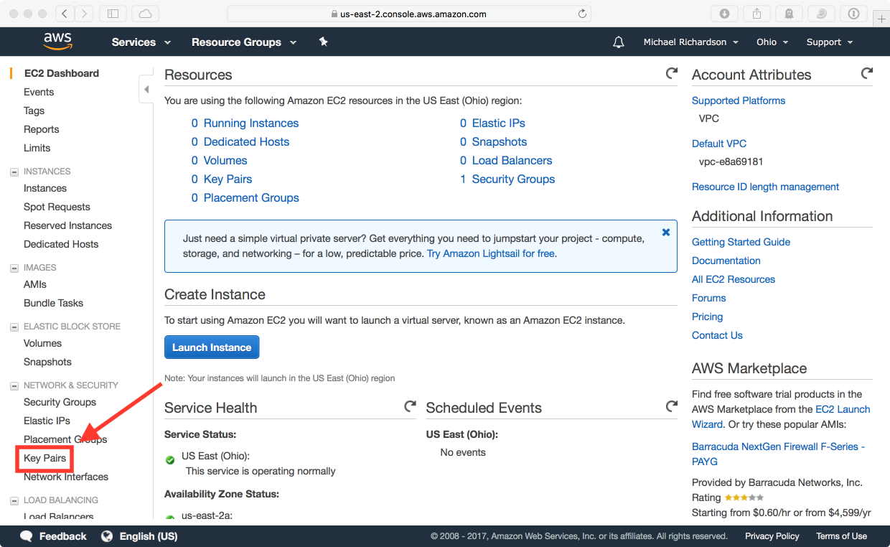
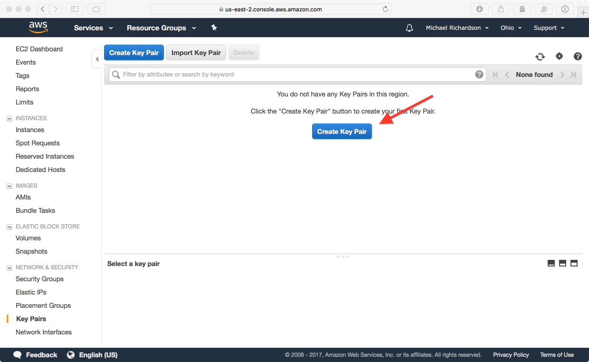
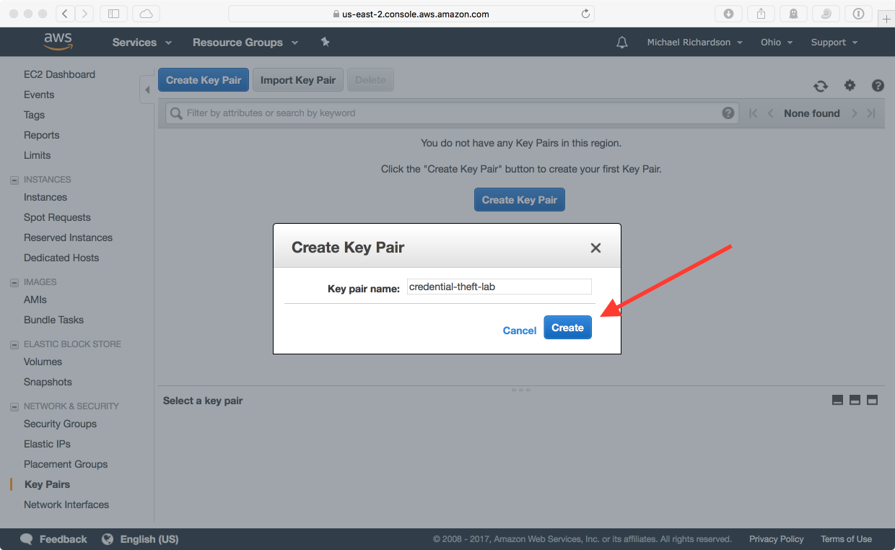
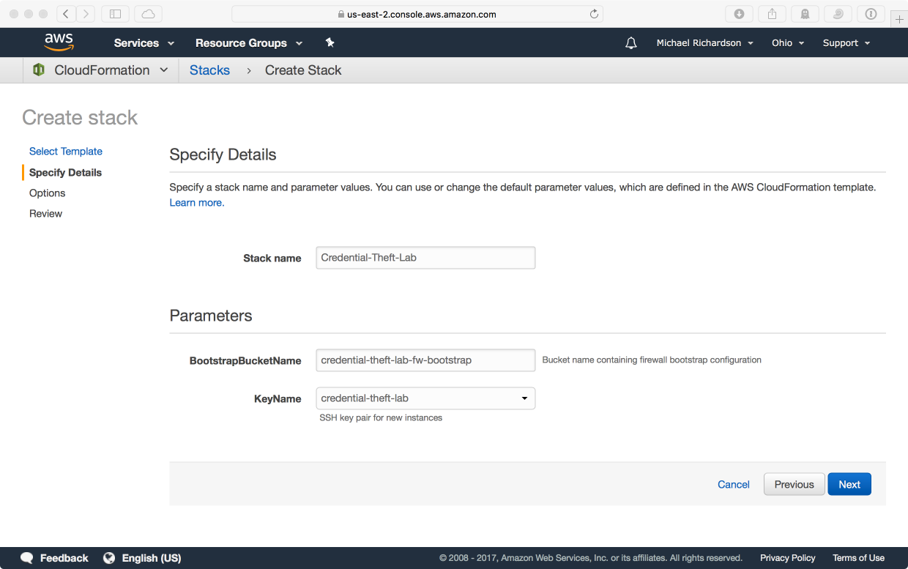
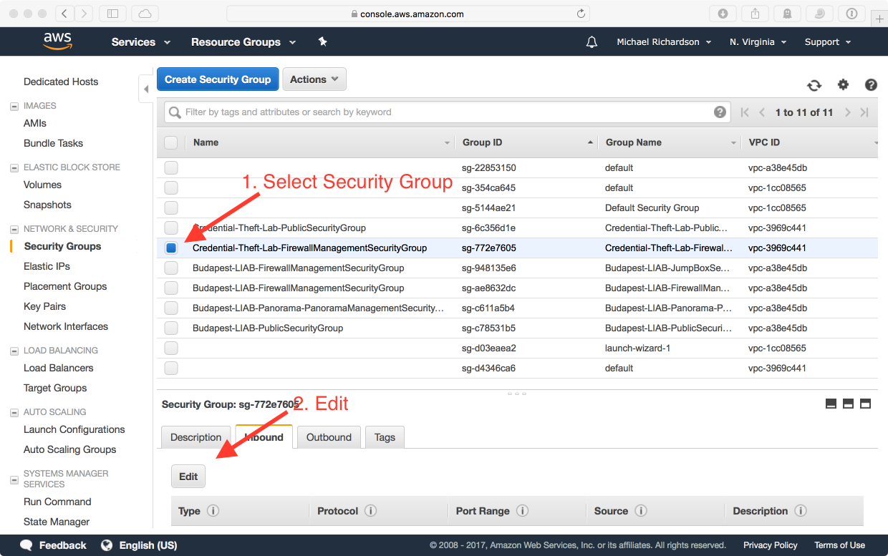
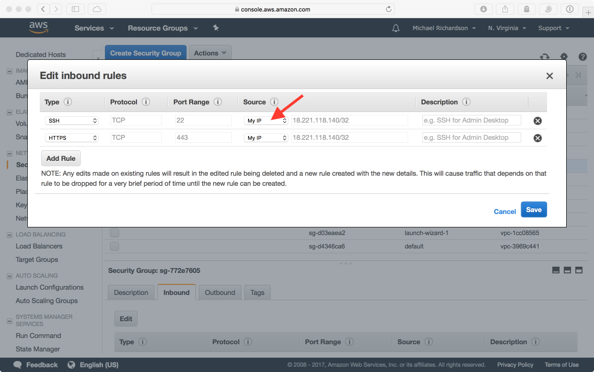
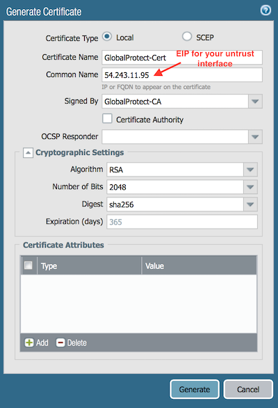
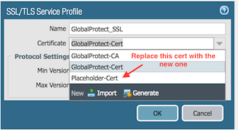
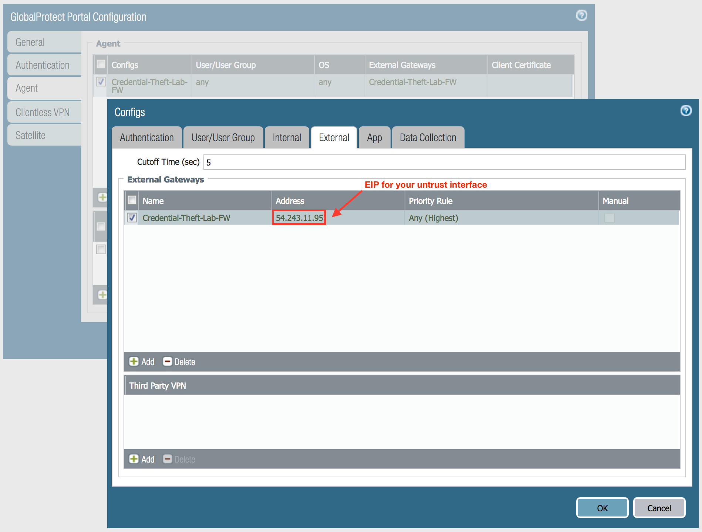

<h1>Getting Started</h1>

## EC2 Key Pair Creation

If you've never used AWS before, you will need to create a SSH key pair that 
will be used for the initial login to EC2 instances.  If you've already got an 
SSH key pair that you would like to use in your desired region, feel free to 
skip this step.

In the EC2 section of the AWS console, click **Key Pairs**.

Click **Create Key Pair**, give your key pair a name, and click **Create**.

A SSH public/private key pair will be created for you, and the private key 
will be downloaded by the browser.  This key pair will be used to log into the firewall instance.  

For more information, see the [EC2 Key Pair documentation](https://docs.aws.amazon.com/AWSEC2/latest/UserGuide/ec2-key-pairs.html?icmpid=docs_ec2_console>).

## CloudFormation

In CloudFormation, create a new stack using the following URL:

``https://raw.githubusercontent.com/mrichardson03/credential-theft-lab/master/credential-theft-lab.json``

This will always point to the latest version of the template.

CloudFormation will ask for a stack name.  You can call it whatever you want, but the rest of this 
guide assumes that it will be **Credential-Theft-Lab**.  Everything created by the template will 
use the stack name as a prefix so you can easily identify them.

The two parameters for the stack are **BootstrapBucketName** and **KeyName**.  The bootstrap bucket 
contains the initial configuration for the firewall (located ``here`` for reference), and the 
KeyName dropdown should be used to select the SSH key pair you want to log into the firewall 
initially.

The stack will create all the required AWS resources for you.  After the stack has finished, click 
the **Outputs** tab, and make note of the **FirewallManagementInterface** IP address, and the 
**FirewallUntrustInterface** IP address.  They will be used to access the management interface of 
the firewall and the GlobalProtect portal to access the rest of the environment.

## Security Group Configuration

The created management security group for the firewall does not allow inbound access by default.  
In the AWS console, add HTTPS and SSH access from your IP to the 
**Credential-Theft-Lab-FirewallManagementSecurityGroup**.

The **Credential-Theft-Lab-PublicSecurityGroup**, which is associated to the firewall's untrust 
interface is wide open and should need no modifications.

## Log In To Firewall

After giving the firewall instance around 5-10 minutes to initialize and bootstrap, use your SSH key 
to log in as the admin user and set the admin password.

## Generate GlobalProtect Portal Certificate

The bootstrap configuration for the firewall contains a certificate authority for you, but you need 
to create a certificate for the IP address of the firewall's untrust interface.

Use it in place of **Placeholder-Cert** in the **GlobalProtect_SSL** service profile.

## Replace External Gateway in GlobalProtect Portal Config

In the Agent config section of the GlobalProtect portal configuration, navigate to the **External**
tab, and replace the external gateway IP address with your firewall's untrust interface.

## Download/Activate GlobalProtect Client

If you don't have GlobalProtect installed on your laptop, download and activate the latest version 
on the firewall so you can download it when connecting to the GlobalProtect portal.

## Create Phishing Victim Account

We will be sending a phishing email as part of this lab.  You can either use your personal Gmail 
account, or create a new one for this lab.