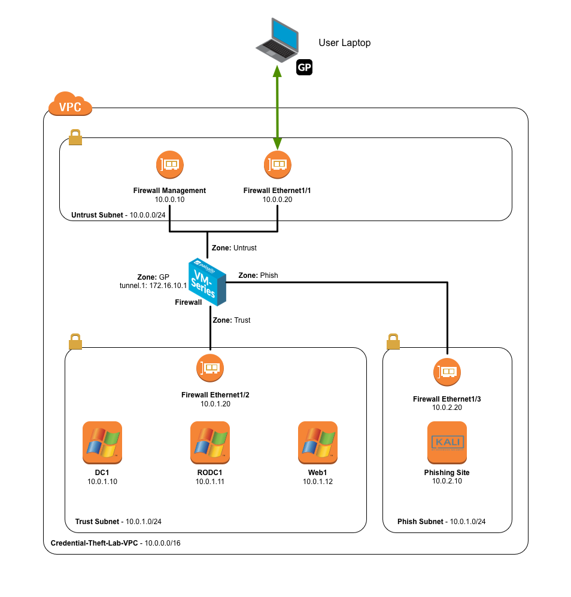

<h1>Credential Theft Lab</h1>

## Background

Phishing attacks to obtain valid corporate credentials are one of the common 
factors in many breaches today.  If the attacker caon obtain valid credentials,
they can walk right into the enterprise network bypassing most security solutions and not arouse any suspicions.

In this lab, we will see how we can use URL Filtering capabilities to prevent 
exposure of corporate credentials.

---

## Lab Diagram

You will instantiate an AWS CloudFormation template that builds the below
environment.  It will create the VPC, subnets, security groups, and instances
shown.  You will then connect into the environment using the GlobalProtect client.

## Access Details

You will need this information throughout the lab.

***Table 1* - Lab Instances**

Device	                    | IP	                  | Username      | Password
--------------------------- | ----------------------- | ------------- | ---------
Firewall                    | *Set by CloudFormation* | admin         | *Set by user*  
Domain Controller           | 10.0.1.10               | Administrator | paloalto
Read Only Domain Controller | 10.0.1.11               | Administrator | paloalto
Web Server                  | 10.0.1.12               | Administrator | paloalto
Phishing Site (Kali Linux)  | 10.0.2.10               | kali          | paloalto

***Table 2* - Corporate Active Directory Accounts - Credlab.local**

Username      | Password
------------- | --------
Administrator | paloalto
user1         | paloalto
user2         | paloalto
user3         | paloalto