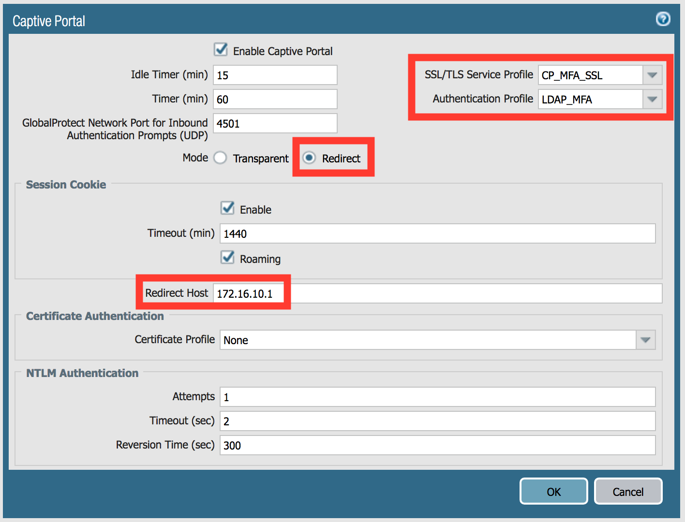

<h1>Multi-Factor Authentication</h1>

### Duo Setup

We will be using Duo to demonstrate multi-factor authentication.  You will create a Duo account,
and then enroll your personal phone in it to receive the authentication challenges.

Go to [signup.duo.com](https://signup.duo.com) and sign up for a free Duo Account.  Be sure to
check the **I'm an MSP, Reseller, or Partner** box when signing up.

Complete the enrollment, then follow the instructions to download and install Duo Mobile.  You will
need this to log into the Duo Administration portal, as well as the MFA steps later in the lab.

On the Duo Adminstration Portal, click on **Applications**, then on **Protect an Application**.

Choose **Palo Alto SSL VPN** as the application you are protecting.  We're not using that
application specifically, but the integration parameters are the same.

You will need the **Integration Key**, the **Secret Key**, and the **API Hostname** from this 
section, so save them somewhere.  You can also change the name of the application that gets 
displayed in the push notification to users by modifying the **Name** filed.  Scroll to the bottom
and click **Save Your Changes**.

Now click on **Users**, then on **Add User**.

The username here **must** match who you are authenticating as (user1, user2, user3).  Enter a 
username, then click **Add User**.

Scroll down on this next screen and click on **Add Phone**.   Add your phone number.

On the next screen, under the **Device Info** section, click **Activate Duo Mobile**.  Duo will 
generate activation codes for the Duo Mobile application for you, and then offer to send them via 
SMS.

Send the instructions to your phone and complete enrollment.

### Firewall Configuration

In the **Device** tab, add a Multi Factor Authentication server profile:

  - **Profile Name**: DUO_MFA
  - **Certificate Profile**: Duo-Cert-Profile (certificates have been imported for you already)
  - **MFA Vendor**: Duo v2
  - **API Host**, **Integration Key**, and **Secret Key** are what you recorded from earlier.
    *They're in a different order here, so be sure you're copying and pasting correctly!*

Add a new **Authentication Profile** by cloning the existing LDAP_Auth profile.  Call it 
**LDAP_MFA**, and add the **DUO_MFA** profile to it as an additional factor.

Captive Portal is used to deliver the MFA prompt, so that needs to be configured next.  There
should be a self-signed certificate for the portal already created (CP-MFA), as well as a SSL/TLS
profile (CP_MFA_SSL) for you to use.

Configure Captive Portal for the GP tunnel interface as shown:

We want GlobalProtect to prompt us to authenticate for applications that aren't web based, so we
need to add those settings.  In the Agent config section of the GlobalProtect portal configuration,
click on the **App** tab and include the following settings:

  - **Enable Inbound Authentication Prompts from MFA Gateways**: Yes
  - **Network Port for Inbound Authentication Prompts (UDP)**: 4501
  - **Trusted MFA Gateways**: 172.16.10.1

In **Objects > Authentication**, create a new authentication object using the authentication 
profile.

In the **Authentication** policy, create a rule to trigger the challenge for traffic destined for
our web server.  Set the timeout to a smaller value (1 minute) to make testing easier.

  - **Policy Name:** Require MFA
  - **Source Zone:** GP
  - **Destination Zone:** TRUST
  - **Destination Address:** 10.0.1.12
  - **Service:** service-http, service-rdp
  - **Authentication Enforcement:** Duo-Authentication

The security policy **Allow to Intranet** already allows traffic to this destination, so no changes
are required to it.

Commit the configuration.

### Verification

On the menu of your GlobalProtect client, click **Rediscover Network** to make sure it has the
latest configuration from the Portal.

Open a browser and connect to [http://web1.credlab.local](http://web1.credlab.local).  When 
directed to the captive portal page, accept the self-signed certificate warning prompt.

Log in to the captive portal page using the username and password corresponding to the user that 
you enrolled in Duo.  The first factor authentication will be done against the LDAP server.

Once the first factor has succeeded, the user is redirected to the second factor page.  In this 
lab, a push notification is sent to the user's device for the second factor authentication.  
On your device, either allow or deny the access.

On the firewall under **Monitor > Logs > Authentication**, you can view the authentication logs.
Note the two authentications, one for LDAP and one for Duo.

  

If you opted to approve the authentication using the Duo app, the authentication will succeed and 
you will be redirected to the restricted site, which in our case is just the IIS default page.

You can also deliver authentication challenges for applications that are not web-based.  Open 
Remote Desktop and attempt to connect to web1.credlab.local.  The initial connection will fail, but
the GlobalProtect client will display a pop-up asking you to authenticate.  Click the link to open
the captive portal page, and authenticate as before.

After authenticating, attempt the Remote Desktop connection again and you should be able to connect
to the server.

You're done with this section of the lab.